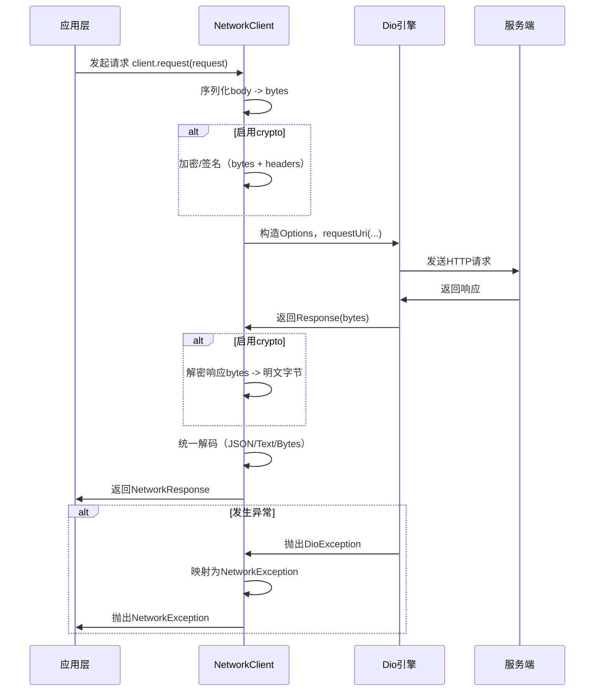

# scaffold_core 网络库设计与使用说明

## 目标与原则

- 提供与具体应用无关的统一网络能力：请求、响应、错误、序列化（固定使用 Dio 作为底层引擎）
- 隔离底层库差异（默认使用 Dio），替换底层只需在 core 内更改，不影响应用层
- 暴露最小且稳定的 API，支持大型项目的扩展（鉴权、重试、埋点、灰度、Mock 等）

## 模块结构

- 类型与配置：[types.dart](types.dart)
  - NetworkMethod、NetworkResponseType
  - NetworkRequest / NetworkResponse
  - ApiResponse（通用业务协议响应模型）
  - NetworkClientOptions（baseUrl、默认头、超时）
  - 取消使用 Dio 的 CancelToken（直接透传）
- 加解密协议：[crypto.dart](crypto.dart)
  - NetworkCrypto（由应用层实现，core 负责串联调用时机）
  - NetworkCryptoRequest/Response（加密/解密上下文）
- 错误模型：[errors.dart](errors.dart)
  - NetworkErrorType（timeout/network/badResponse/cancelled/serialization/business/unknown）
  - NetworkErrorCodes（统一错误码：网络层负数区间 + 业务码透传）
  - NetworkException（统一异常，包含请求/响应/业务补充信息）
- Dio 专用实现：
  - [interceptors/header_injector_interceptor.dart](interceptors/header_injector_interceptor.dart)：Header 注入（静态 + 动态）
  - [interceptors/auth_interceptor.dart](interceptors/auth_interceptor.dart)：鉴权（401 单飞刷新 + 重放 + 刷新失败登出）
  - [interceptors/logging_interceptor.dart](interceptors/logging_interceptor.dart)：请求/响应/错误日志打印（含 curl）
  - [interceptors/retry_interceptor.dart](interceptors/retry_interceptor.dart)：指数退避重试策略
  - [interceptors/timeout_interceptor.dart](interceptors/timeout_interceptor.dart)：超时配置（可覆盖/可回退）
- 序列化协议：[serializer.dart](serializer.dart)
  - NetworkSerializer（contentType/encode/decode）
  - JsonNetworkSerializer（默认实现）
- 发送层（固定使用 Dio）
  - 通过 NetworkClient 构造内部 Dio 实例或接收外部 Dio
  - 支持配置 BaseOptions 与添加 Dio Interceptors
- 客户端入口：[network_client.dart](network_client.dart)
  - 直接基于 Dio 实现请求发送与错误归一化

## 数据流与执行顺序

1. 应用构造 NetworkClient（可配置 options、serializer、crypto、Dio 与其拦截器）
2. 发起请求：`client.request(request)`
3. 客户端解析 URI、合并 headers，并用 serializer 将 body 序列化为 bytes
4. 若启用 crypto：对请求 bytes 加密/签名，并可追加/覆盖 headers
5. 客户端构造 Dio Options 并调用 Dio
6. 若启用 crypto：对响应 bytes 解密为明文字节
7. 客户端根据 responseType + serializer 解码，得到 NetworkResponse
8. 出现异常时归一化为 NetworkException（基于 DioException 映射）

## 快速使用

```dart
import 'package:scaffold_core/core_network/network_client.dart';
import 'package:scaffold_core/core_network/types.dart';

final client = NetworkClient(
  options: const NetworkClientOptions(
    baseUrl: 'https://api.example.com',
  ),
);

// GET 列表（JSON 数组）
final orders = await client.getList('/orders');

// POST JSON 对象
final login = await client.post(
  '/auth/login',
  body: {'account': 'foo', 'password': 'bar'},
);
```

## 通用请求接口

```dart
import 'package:scaffold_core/core_network/network_client.dart';
import 'package:scaffold_core/core_network/types.dart';

final response = await client.request<Map<String, dynamic>>(
  NetworkRequest(
    method: NetworkMethod.get,
    path: '/users/123',
    headers: {'x-trace-id': 'abc'},
    queryParameters: {'expand': 'roles'},
    timeout: const Duration(seconds: 8),
    responseType: NetworkResponseType.json,
  ),
);

print(response.statusCode);
print(response.headers);
print(response.data);     // 已按 JSON 解码
print(response.rawBytes); // 原始字节
```

## 业务协议请求接口（code/message/data）

适配常见后端 JSON：`{ code, message/msg, data }`。

```dart
import 'package:scaffold_core/core_network/network_client.dart';
import 'package:scaffold_core/core_network/types.dart';

final resp = await client.requestApi<Map<String, dynamic>>(
  NetworkRequest(
    method: NetworkMethod.get,
    path: '/profile',
  ),
  successCode: 0,
  codeKey: 'code',
  messageKeys: const ['message', 'msg'],
  dataKey: 'data',
);

final api = resp.data;
print(api.code);
print(api.message);
print(api.data);
```

## 错误处理

```dart
import 'package:scaffold_core/core_network/errors.dart';

try {
  final data = await client.getList('/orders');
} on NetworkException catch (e) {
  switch (e.type) {
    case NetworkErrorType.timeout:
    case NetworkErrorType.network:
      // 网络异常：提示用户或重试
      break;
    case NetworkErrorType.badResponse:
      // 非 2xx 响应：结合 e.statusCode / e.responseHeaders 做处理
      break;
    case NetworkErrorType.serialization:
      // 反序列化失败：排查返回体或解码策略
      break;
    case NetworkErrorType.business:
      // 业务异常：可读取 e.businessCode / e.businessPayload
      break;
    default:
      // 其它异常
      break;
  }
}
```

## 拦截器链（推荐顺序）

建议拦截器顺序：

1. Header 注入（补充 traceId、locale 等）
2. 鉴权（注入 Authorization，401 触发刷新）
3. 日志（打印请求/响应/错误）
4. 超时（统一超时或覆盖默认）
5. 重试/退避（对可重试错误进行指数退避重放）

说明：

- 重试通常建议放在链路靠后，避免把“可恢复错误”提前终止，同时让日志能看到每次重试的细节
- 若业务对日志体积敏感，可把日志拦截器放到最后只记录最终结果

## Dio 拦截器配置示例（Header + 鉴权 + 日志 + 超时 + 重试）

```dart
import 'package:dio/dio.dart';
import 'package:scaffold_core/core_network/network_client.dart';
import 'package:scaffold_core/core_network/interceptors/auth_interceptor.dart';
import 'package:scaffold_core/core_network/interceptors/header_injector_interceptor.dart';
import 'package:scaffold_core/core_network/interceptors/logging_interceptor.dart';
import 'package:scaffold_core/core_network/interceptors/retry_interceptor.dart';
import 'package:scaffold_core/core_network/interceptors/timeout_interceptor.dart';

final dio = Dio(
  BaseOptions(
    baseUrl: 'https://api.example.com',
    connectTimeout: const Duration(seconds: 10),
    receiveTimeout: const Duration(seconds: 15),
    responseType: ResponseType.bytes,
  ),
);

dio.interceptors.add(
  DioHeaderInjectorInterceptor(
    staticHeaders: const {'x-app': 'demo'},
    headersBuilder: (options) async => {'x-trace-id': 'trace-${DateTime.now().millisecondsSinceEpoch}'},
  ),
);

dio.interceptors.add(
  DioAuthInterceptor(
    dio: dio,
    getAccessToken: () async => 'your_access_token',
    getRefreshToken: () async => 'your_refresh_token',
    refreshTokens: (refreshToken) async {
      // 这里请求你的“刷新 Token 接口”，成功后返回新 token
      // 注意：刷新接口建议额外标记 __skip_auth_refresh__，避免递归刷新
      return const AuthTokens(accessToken: 'new_access_token', refreshToken: 'new_refresh_token');
    },
    onTokenUpdated: (tokens) async {
      // 持久化保存 tokens
    },
    onLogout: () async {
      // 统一退出登录（清理 token、跳转登录页等）
    },
  ),
);

dio.interceptors.add(DioLoggingInterceptor(
  logHeaders: false,
  logRequestBody: false,
  logResponseBody: false,
));

dio.interceptors.add(
  DioTimeoutInterceptor(
    connectTimeout: const Duration(seconds: 10),
    sendTimeout: const Duration(seconds: 10),
    receiveTimeout: const Duration(seconds: 15),
  ),
);

dio.interceptors.add(DioRetryInterceptor(
  dio,
  const DioRetryPolicy(maxAttempts: 3),
));

final client = NetworkClient(
  options: const NetworkClientOptions(baseUrl: 'https://api.example.com'),
  dio: dio,
);
```

## Token 自动刷新（401 单飞刷新 + 重放 + 刷新失败登出）

鉴权拦截器实现见：[DioAuthInterceptor](interceptors/auth_interceptor.dart)。

- 401 触发刷新：当请求返回 401 且未标记重放时，会尝试刷新 token
- 单飞刷新：并发多个 401 只会触发一次刷新请求，其他请求等待同一个刷新 Future
- 刷新成功重放：刷新成功后会更新 Authorization，并用原始 RequestOptions 重放请求
- 刷新失败统一退出：刷新失败/异常会触发登出回调（只触发一次）

跳过规则（通过 RequestOptions.extra）：

- `__skip_auth__ = true`：跳过鉴权头注入与 401 处理
- `__skip_auth_refresh__ = true`：遇到 401 不刷新，直接触发登出
- `__auth_replayed__ = true`：内部标记，避免重放死循环

## 自定义序列化

```dart
import 'package:scaffold_core/core_network/serializer.dart';

class ProtoSerializer extends NetworkSerializer {
  @override
  String contentType() => 'application/x-protobuf';

  @override
  List<int> encode(Object body) {
    // TODO: 实现 protobuf 编码
    throw UnimplementedError();
  }

  @override
  Object? decode(List<int> bytes) {
    // TODO: 实现 protobuf 解码
    throw UnimplementedError();
  }
}

final client = NetworkClient(serializer: ProtoSerializer());
```

## 接口加解密（由应用层提供实现）

core_network 只负责“串联调用时机”，不内置任何算法与密钥管理。应用层通过实现 [NetworkCrypto](crypto.dart) 注入加解密逻辑。

约定：

- 请求加密发生在 serializer.encode 之后（拿到请求体 bytes 后再加密/签名）
- 响应解密发生在 serializer.decode 之前（先把 wire bytes 解密为明文字节，再按 json/text/bytes 解码）
- `NetworkResponse.rawBytes` 始终保留“网络原始字节”（wire bytes，通常为加密后的响应体）
- 加密/解密失败会抛出 NetworkException（type=serialization），便于在上层统一降级与埋点

与拦截器的关系：

- 由于加密发生在 Dio 发送前，因此 Dio 拦截器链看到的是“加密后的 body bytes”以及注入后的签名/nonce 等 headers
- 若需要打印明文请求/响应，建议在应用层实现 NetworkCrypto 时自行埋点（注意脱敏），或在加密前后各自记录必要字段

示例：

```dart
import 'package:scaffold_core/core_network/crypto.dart';
import 'package:scaffold_core/core_network/network_client.dart';
import 'package:scaffold_core/core_network/types.dart';

class AppCrypto extends NetworkCrypto {
  const AppCrypto();

  @override
  NetworkCryptoResult encrypt(NetworkCryptoRequest request) {
    // TODO: 将 request.bodyBytes 加密，并返回密文 bytes
    // TODO: 如需签名/nonce，可通过 headers 注入
    return NetworkCryptoResult(
      headers: const {'x-crypto': '1'},
      bodyBytes: request.bodyBytes,
    );
  }

  @override
  List<int> decrypt(NetworkCryptoResponse response) {
    // TODO: 将 response.bodyBytes 解密为明文字节
    return response.bodyBytes;
  }
}

final client = NetworkClient(
  options: const NetworkClientOptions(baseUrl: 'https://api.example.com'),
  crypto: const AppCrypto(),
);
```

## 配置 Dio 引擎

```dart
final client = NetworkClient(
  options: const NetworkClientOptions(baseUrl: 'https://api.example.com'),
  dioInterceptors: [
    // 根据需要添加原生 Dio Interceptors
  ],
);
```

## 取消与进度

- 取消：使用 Dio 的 CancelToken，直接传入 NetworkClient.request 的 cancelToken
- 进度：可在 NetworkClient 内增加参数映射到 Dio 的 onSendProgress/onReceiveProgress（按需扩展）

## Mock 与测试建议

- 不建议在 core 内放业务 Mock；如需测试，可在应用侧实现自定义适配器（实现 NetworkClientAdapter），返回期望的 NetworkRawResponse
- 也可使用服务端或代理工具进行接口 Mock，保持客户端逻辑不变

## 设计取舍

- 默认字节响应：统一上层解码路径，避免底层库在 JSON/Text 处理上的差异
- 依赖 Dio：充分利用成熟引擎能力（拦截器、取消、重试等）
- 简化层级：统一在 NetworkClient 内构造与调用 Dio，减少抽象层

## 调用流程图



## 结论

该网络库将“底层引擎能力”与“应用无关协议”分层：业务模块只依赖 NetworkClient/Request/Response/Exception 等稳定接口；Header/鉴权/日志/超时/重试等策略通过拦截器链实现与复用。
