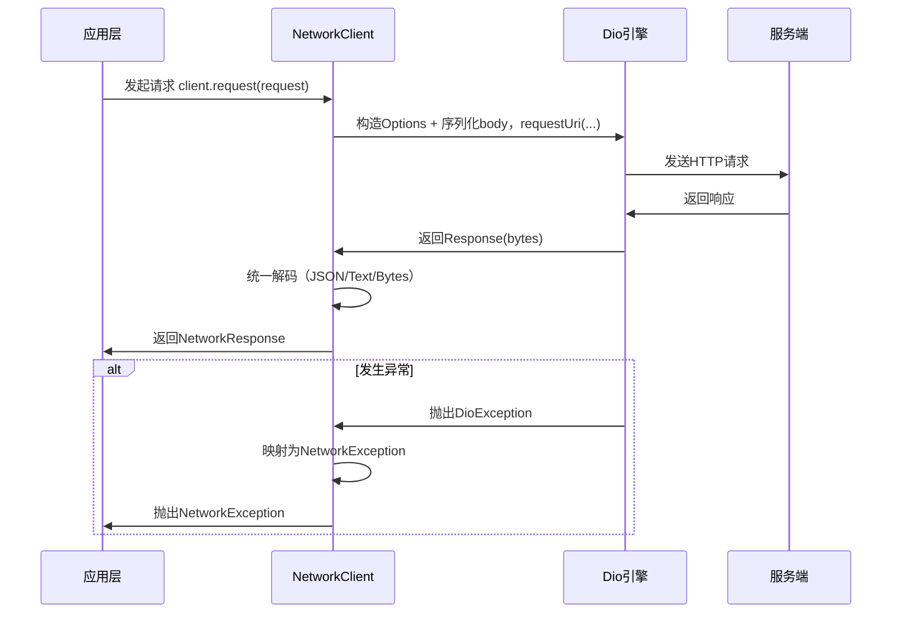

# scaffold_core 网络库设计与使用说明

## 目标与原则

- 提供与具体应用无关的统一网络能力：请求、响应、错误、序列化（固定使用 Dio 作为底层引擎）
- 隔离底层库差异（默认使用 Dio），替换底层只需在 core 内更改，不影响应用层
- 暴露最小且稳定的 API，支持大型项目的扩展（鉴权、重试、埋点、灰度、Mock 等）

## 模块结构

- 类型与配置：[types.dart](types.dart)
  - NetworkMethod、NetworkResponseType
  - NetworkRequest / NetworkResponse
  - NetworkClientOptions（baseUrl、默认头、超时）
  - 取消使用 Dio 的 CancelToken（直接透传）
- 错误模型：[errors.dart](errors.dart)
  - NetworkErrorType（timeout/network/badResponse/cancelled/serialization/unknown）
  - NetworkException（统一异常，包含请求与底层响应信息）
- Dio 专用实现：
  - [interceptors/logging_interceptor.dart](interceptors/logging_interceptor.dart)：请求/响应/错误日志打印（含 curl）
  - [interceptors/retry_interceptor.dart](interceptors/retry_interceptor.dart)：指数退避重试策略
- 序列化协议：[serializer.dart](serializer.dart)
  - NetworkSerializer（contentType/encode/decode）
  - JsonNetworkSerializer（默认实现）
- 发送层（固定使用 Dio）
  - 通过 NetworkClient 构造内部 Dio 实例或接收外部 Dio
  - 支持配置 BaseOptions 与添加 Dio Interceptors
- 客户端入口：[network_client.dart](network_client.dart)
  - 直接基于 Dio 实现请求发送与错误归一化

## 数据流与执行顺序

1. 应用构造 NetworkClient（可配置 options、serializer、Dio 与其拦截器）
2. 发起请求：`client.request(request)`
3. 客户端构造 Dio Options 与请求体字节并调用 Dio
4. 客户端根据 responseType + serializer 解码，得到 NetworkResponse
5. 出现异常时归一化为 NetworkException（基于 DioException 映射）

## 快速使用

```dart
import 'package:scaffold_core/core_network/network_client.dart';
import 'package:scaffold_core/core_network/types.dart';

final client = NetworkClient(
  options: const NetworkClientOptions(
    baseUrl: 'https://api.example.com',
  ),
);

// GET 列表（JSON 数组）
final orders = await client.getList('/orders');

// POST JSON 对象
final login = await client.post(
  '/auth/login',
  body: {'account': 'foo', 'password': 'bar'},
);
```

## 通用请求接口

```dart
import 'package:scaffold_core/core_network/network_client.dart';
import 'package:scaffold_core/core_network/types.dart';

final response = await client.request<Map<String, dynamic>>(
  NetworkRequest(
    method: NetworkMethod.get,
    path: '/users/123',
    headers: {'x-trace-id': 'abc'},
    queryParameters: {'expand': 'roles'},
    timeout: const Duration(seconds: 8),
    responseType: NetworkResponseType.json,
  ),
);

print(response.statusCode);
print(response.headers);
print(response.data);     // 已按 JSON 解码
print(response.rawBytes); // 原始字节
```

## 错误处理

```dart
import 'package:scaffold_core/core_network/errors.dart';

try {
  final data = await client.getList('/orders');
} on NetworkException catch (e) {
  switch (e.type) {
    case NetworkErrorType.timeout:
    case NetworkErrorType.network:
      // 网络异常：提示用户或重试
      break;
    case NetworkErrorType.badResponse:
      // 非 2xx 响应：结合 e.statusCode / e.responseHeaders 做处理
      break;
    case NetworkErrorType.serialization:
      // 反序列化失败：排查返回体或解码策略
      break;
    default:
      // 其它异常
      break;
  }
}
```

## Dio 拦截器配置示例

```dart
import 'package:dio/dio.dart';
import 'package:scaffold_core/core_network/network_client.dart';
import 'package:scaffold_core/core_network/interceptors/logging_interceptor.dart';
import 'package:scaffold_core/core_network/interceptors/retry_interceptor.dart';

final dio = Dio(
  BaseOptions(
    baseUrl: 'https://api.example.com',
    connectTimeout: const Duration(seconds: 10),
    receiveTimeout: const Duration(seconds: 15),
    responseType: ResponseType.bytes,
  ),
);

dio.interceptors.add(DioLoggingInterceptor(
  logHeaders: false,
  logRequestBody: false,
  logResponseBody: false,
));
dio.interceptors.add(DioRetryInterceptor(
  dio,
  const DioRetryPolicy(maxAttempts: 3),
));

final client = NetworkClient(
  options: const NetworkClientOptions(baseUrl: 'https://api.example.com'),
  dio: dio,
);
```

## 自定义序列化

```dart
import 'package:scaffold_core/core_network/serializer.dart';

class ProtoSerializer extends NetworkSerializer {
  @override
  String contentType() => 'application/x-protobuf';

  @override
  List<int> encode(Object body) {
    // TODO: 实现 protobuf 编码
    throw UnimplementedError();
  }

  @override
  Object? decode(List<int> bytes) {
    // TODO: 实现 protobuf 解码
    throw UnimplementedError();
  }
}

final client = NetworkClient(serializer: ProtoSerializer());
```

## 配置 Dio 引擎

```dart
final client = NetworkClient(
  options: const NetworkClientOptions(baseUrl: 'https://api.example.com'),
  dioInterceptors: [
    // 根据需要添加原生 Dio Interceptors
  ],
);
```

## 取消与进度

- 取消：使用 Dio 的 CancelToken，直接传入 NetworkClient.request 的 cancelToken
- 进度：可在 NetworkClient 内增加参数映射到 Dio 的 onSendProgress/onReceiveProgress（按需扩展）

## Mock 与测试建议

- 不建议在 core 内放业务 Mock；如需测试，可在应用侧实现自定义适配器（实现 NetworkClientAdapter），返回期望的 NetworkRawResponse
- 也可使用服务端或代理工具进行接口 Mock，保持客户端逻辑不变

## 设计取舍

- 默认字节响应：统一上层解码路径，避免底层库在 JSON/Text 处理上的差异
- 依赖 Dio：充分利用成熟引擎能力（拦截器、取消、重试等）
- 简化层级：统一在 NetworkClient 内构造与调用 Dio，减少抽象层

## 调用流程图



## 结论

该网络库将“底层引擎能力”与“应用无关协议”分层，既能用到成熟库（Dio）的特性，又确保替换底层不会影响应用代码。业务模块只依赖 NetworkClient/Request/Response/Exception 等稳定接口，拦截器承载跨模块的统一策略与扩展点。*** End Patch***  }``` */}
