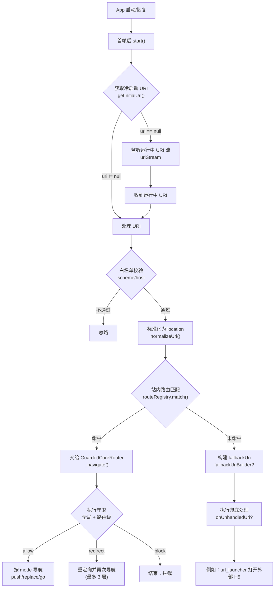

# core_router

## 目标

core_router 提供一个与具体路由库无关、可逐步扩展的路由基础层，用于：

- 让业务层依赖稳定接口，而不是依赖某个路由库的 API
- 便于在不同工程中替换路由方案（Navigator 1.0 / go_router / auto_route 等）
- 便于测试（可注入一个内存实现或 mock 实现）
- 统一承载中心化注册、守卫、防重入、深链等路由横切能力

## 核心抽象

[CoreRouter](core_router.dart) 是唯一必须遵守的接口，设计为“最小可用集合”：

- `push(location, extra)`：入栈导航
- `replace(location, extra)`：替换当前页面
- `go(location, extra)`：跳转并清空栈（应用可根据路由库能力做等价实现）
- `pop([result]) / canPop()`：返回能力
- `popUntil(location)`：返回到指定页面
- `navigatorKey`：支持在无 BuildContext 的场景触发导航

其中：

- `location` 作为统一的路由标识，通常映射为路由路径（如 `/login`）
- `extra` 作为透传参数，适配到不同路由库的 arguments/extra

## 中心化注册

新增的中心化注册体系由以下对象组成：

- [CoreRouteDefinition](core_route_definition.dart)：单条路由定义，声明路径、页面构建器、守卫、元数据和导航策略
- [CoreRouteRegistry](core_route_registry.dart)：路由注册中心，负责标准化 location、匹配路由，以及生成 `onGenerateRoute/onUnknownRoute`
- [CoreRouteState](core_route_state.dart)：单次路由匹配后的运行时状态，统一暴露 `uri/path/pathParameters/queryParameters/extra`

示例：

```dart
final registry = CoreRouteRegistry(
  routes: <CoreRouteDefinition>[
    CoreRouteDefinition(
      path: '/orders/:id',
      pageBuilder: (context, state) {
        final orderId = state.pathParameters['id'];
        return OrderDetailPage(orderId: orderId!);
      },
    ),
  ],
);
```

## 复杂参数序列化

[CoreRouteCodec](core_route_codec.dart) 负责复杂参数编解码：

- `String / num / bool` 直接转为 query 字符串
- 复杂对象使用 `JSON + Base64Url` 编码，避免特殊字符污染 URL
- 解码时可通过 `decodeObject` 恢复为业务对象

示例：

```dart
final location = Uri(
  path: '/orders',
  queryParameters: CoreRouteCodec.encodeQueryParameters(
    <String, Object?>{
      'filter': <String, Object?>{
        'status': 'paid',
        'page': 2,
      },
    },
  ),
).toString();
```

## 路由守卫

[CoreRouteGuard](core_route_guard.dart) 是统一守卫接口，当前内置：

- `CoreAuthGuard`：登录态守卫
- `CorePermissionGuard`：权限守卫

守卫在真正导航前执行，可返回：

- `allow()`：放行
- `block()`：拦截
- `redirect(location)`：拦截并重定向

示例：

```dart
CoreRouteDefinition(
  path: '/profile',
  pageBuilder: (context, state) => const ProfilePage(),
  guards: <CoreRouteGuard>[
    CoreAuthGuard(
      isAuthenticated: () => authSessionService.currentSession != null,
      redirectLocation: '/login',
    ),
  ],
)
```

## 防重连点

[CoreNavigationPolicy](core_route_definition.dart) 用于控制重复点击、竞态跳转和重复深链：

- `preventDuplicate`：同一导航成功后再次触发时去重
- `singleFlight`：同一导航在执行中时不允许重复发起
- `throttleDuration`：在节流窗口内忽略重复触发
- `dedupeKeyBuilder`：自定义去重 key 规则

[GuardedCoreRouter](guarded_core_router.dart) 会在底层 `CoreRouter` 之上统一执行上述策略。

## 深链能力

[CoreDeepLinkCoordinator](core_deep_link.dart) 负责深链协同：

- 通过 `CoreDeepLinkSource` 抽象深链来源
- 默认实现 `UniLinksDeepLinkSource` 基于 `uni_links`
- 支持处理冷启动链接和运行中链接
- 先尝试命中站内路由，未命中时交给 `onUnhandledUri` 做 H5 或外部跳转兜底

### 处理流程图

部分 Markdown 渲染器可能不支持 Mermaid。若展示失败，请参考下方“纯文本流程图”。



### 纯文本流程图

```text
App 启动/恢复
  └─ 首帧后 start()
       ├─ getInitialUri()（冷启动链接）
       │    └─ 若 uri != null → 处理 URI
       └─ 监听 uriStream（运行中链接）
            └─ 每次收到 uri → 处理 URI

处理 URI
  ├─ 白名单校验（scheme/host）
  │    ├─ 不通过 → 忽略
  │    └─ 通过
  ├─ normalizeUri() → location
  ├─ routeRegistry.match(location)
  │    ├─ 命中
  │    │    └─ GuardedCoreRouter._navigate()
  │    │         ├─ 执行守卫（全局 + 路由级）
  │    │         │    ├─ allow → push/replace/go
  │    │         │    ├─ redirect → 重定向（最多 3 层）
  │    │         │    └─ block → 拦截结束
  │    └─ 未命中
  │         └─ fallbackUriBuilder? → fallbackUri
  │              └─ onUnhandledUri?（例如打开外部 H5）
```

典型接入流程：

1. 在应用启动时创建 `CoreRouteRegistry`
2. 用 `GuardedCoreRouter` 包装底层路由实现
3. 创建 `CoreDeepLinkCoordinator`
4. 首帧后调用 `start()`，销毁时调用 `dispose()`

## 默认实现

[NavigatorCoreRouter](navigator_core_router.dart) 是默认实现，基于 Flutter 原生 Navigator 1.0：

- `push` -> `NavigatorState.pushNamed`
- `replace` -> `NavigatorState.pushReplacementNamed`
- `go` -> `NavigatorState.pushNamedAndRemoveUntil`（predicate 恒为 false，用于清空栈）
- `extra` -> `RouteSettings.arguments`

当 `navigatorKey.currentState` 为空（例如尚未挂载到 App）时，相关方法会返回一个已完成的 Future，避免抛异常。

## 应用层接入建议

推荐的职责划分：

- `core_router`：提供抽象、注册、守卫、防重入、深链协调能力
- 应用层 `AppRouter`：声明实际页面路由、业务守卫、未知路由页面
- 应用层 `AppScope`：组装 `CoreRouteRegistry`、`GuardedCoreRouter`、`CoreDeepLinkCoordinator`
- 应用根组件：负责启动和释放深链监听

## 如何适配其它路由库

在应用层创建一个适配器，实现 `CoreRouter`，把接口映射到你选择的路由库：

- go_router：可用 `GoRouter.push/go/pop` 等方法完成映射
- auto_route：可用 `StackRouter.push/replace` 等方法完成映射

建议：

- 由应用层负责“location 与具体路由库的 route name/path”的映射规则
- 在依赖注入容器（Scope）里注入 `CoreRouter`，业务只依赖 `CoreRouter`
- 保持“核心抽象写完整注释、应用接入层写完整注释”的约定，后续新增能力也应遵守相同标准
